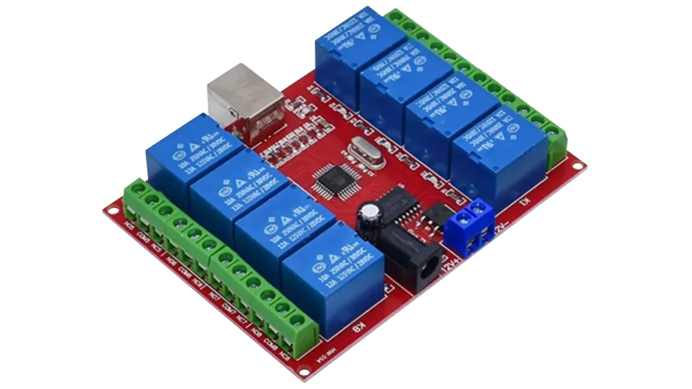

# USBRelay8 Node.js Wrapper

A lightweight and easy-to-use **Node.js wrapper** for controlling the **USBRelay8 (USBB-RELAY08)** relay board via USB.

This project provides both a programmatic API and a CLI tool, making it ideal for automation, IoT setups, and hardware control from Node.js.



---

## Features

- Control individual relays (on/off)
- Switch all relays at once
- Read relay state
- Interactive CLI tool
- Device scanning utility
- Promise-based API
- Clean OOP architecture

---

## Hardware Support

This project is **developed and tested specifically with USBRelay8 hardware**.

- Vendor: https://www.seeit.fr/
- Purchase link: https://benl.rs-online.com/web/p/communication-wireless-development-tools/2864068
- VID/PID: `16c0:05df`

📄 Datasheet available in this repository:

<Datasheet/A700000011182296.pdf>>

> ⚠️ Other relay boards may work, but only USBRelay8 has been validated.

---

## Repository Structure

```
_deprecated/              # Legacy / unused code
src/
  app.js                 # CLI application
  usbrelay/
    UsbRelay.js          # Core relay class
    index.js             # Public module entry
scripts/
  test-relay.js          # Hardware diagnostics
package.json
```

---

## Installation

```bash
npm install
```

---

## Platform Setup

### macOS

No additional setup required.

- Uses `node-hid` backend automatically
- Works out of the box

---

### Windows

Requires driver installation using **Zadig**.

Download: https://zadig.akeo.ie/

#### Tested configuration:
- ✅ `libusb-win32`

#### Likely compatible (not tested):
- ⚠️ `libusbK`

#### Installation Steps:

1. Connect the USB relay board
2. Open Zadig as Administrator
3. Enable: `Options → List All Devices`
4. Select device: **USBRelay8** (VID `16c0`, PID `05df`)
5. Choose driver: `libusb-win32`
6. Click **Install Driver** or **Replace Driver**
7. Reconnect the device
8. Run:

```bash
npm run scan
```

---

## Available Commands

| Command          | Description                          |
|------------------|--------------------------------------|
| `npm start`      | Run interactive CLI                  |
| `npm test`       | Run hardware diagnostics             |
| `npm run scan`   | List connected relay devices         |

---

## Usage

### Basic Example

```js
import { UsbRelay } from './src/usbrelay/index.js';

async function main() {
  const relay = new UsbRelay(8);

  await relay.open();

  await relay.relayOn(1);
  await relay.relayOff(1);
  await relay.allOff();

  console.log(relay.getState());

  await relay.close();
}

main().catch((err) => {
  console.error(err);
  process.exit(1);
});
```

---

## Troubleshooting

If the device is not detected:

1. Verify the device is connected
2. Confirm VID/PID: `16c0:05df`
3. Run:

```bash
npm run scan
```

4. On Windows:
   - Ensure Zadig driver is installed correctly
   - Recommended: `libusb-win32`

---

## Notes

- Built on top of `node-hid`
- Designed for reliability and simplicity
- Suitable for automation, prototyping, and hardware integrations