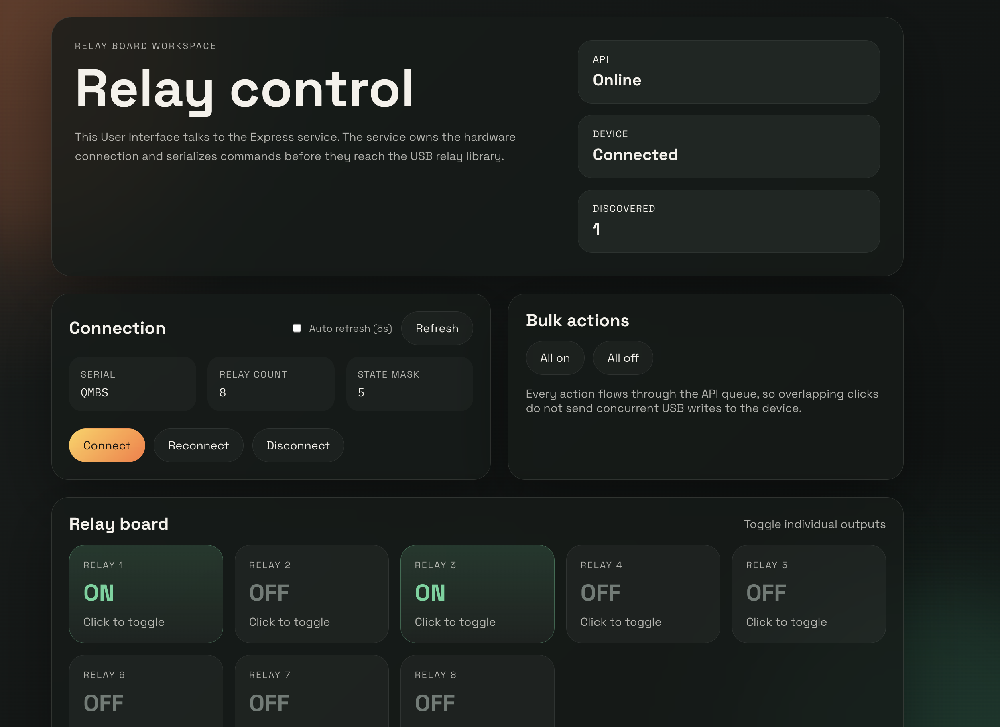

# USB Relay Workspace


This workspace separates the USB relay solution into three independently usable parts:

- `@usb-relay/lib`: reusable Node.js library for USB relay hardware access
- `@usb-relay/api`: Express API that exposes the relay over HTTP
- `@usb-relay/web`: Vite + React frontend that talks to the API

The structure keeps hardware access, backend orchestration, and frontend UI isolated so each layer can evolve or be deployed independently.



---

## Hardware Support

This project is developed and tested specifically with the **USBRelay8 (USBB-RELAY08)** relay board.

- Vendor: https://www.seeit.fr/
- Purchase link: https://benl.rs-online.com/web/p/communication-wireless-development-tools/2864068
- VID/PID: `16c0:05df`

Datasheet available in this repository:

Datasheet/A700000011182296.pdf

Other relay variants may work, but USBRelay8 is the validated target.

---

## Workspace Layout

```
packages/
  usbrelay-lib/   Reusable USB/HID relay library
  usbrelay-api/   Express HTTP API around the library
  usbrelay-web/   Vite + React client
scripts/
  dev.mjs         Starts API and web app together
```

---

## Requirements

- Node.js 20+
- Supported USB relay board (`16c0:05df`)
- On Windows: Zadig driver setup (see below)

---

## Installation

Install all workspace dependencies:

```bash
npm install
```

---

## Platform Setup

### macOS

No additional setup required.

- Uses `node-hid` backend automatically
- Works out of the box

---

### Windows

Requires driver installation using Zadig.

Download:
https://zadig.akeo.ie/

Tested configuration:
- libusb-win32

Likely compatible (not tested):
- libusbK

#### Installation Steps

1. Connect the USB relay board
2. Open Zadig as Administrator
3. Enable Options -> List All Devices
4. Select the relay device (USBRelay8, VID 16c0, PID 05df)
5. Choose libusb-win32 as target driver
6. Click Install Driver or Replace Driver
7. Reconnect the device
8. Verify detection:

```bash
npm run scan
```

---

## Development

Start API and frontend together:

```bash
npm run dev
```

Run only the API:

```bash
npm run dev:api
```

Run only the frontend:

```bash
npm run dev:web
```

---

## Scripts

```bash
npm run dev
npm run dev:api
npm run dev:web
npm run scan
npm run test:hardware
```

---

## Default Ports

- API: http://localhost:3000  
- Frontend: http://localhost:5173  

The Vite dev server proxies /api/* requests to the Express API.

---

## Environment

The API package supports these environment variables:

- PORT: API port (default 3000)
- RELAY_COUNT: number of relays (default 8)
- API_CORS_ORIGIN: allowed frontend origin (default http://localhost:5173)

---

## Usage

### Library (Node.js)

```js
import { UsbRelay } from '@usb-relay/lib';

const relay = new UsbRelay(8);

await relay.open();
await relay.relayOn(1);
await relay.relayOff(1);
await relay.allOff();

console.log(relay.getState());

await relay.close();
```

---

## Troubleshooting

If the device is not detected:

1. Verify the device is connected
2. Confirm VID/PID: 16c0:05df
3. Run:

```bash
npm run scan
```

4. On Windows:
   - Verify Zadig driver installation
   - Recommended: libusb-win32

---

## Architecture Notes

- Hardware communication is isolated in @usb-relay/lib
- The API layer serializes access to the relay device
- The frontend communicates only via HTTP (no native USB access)
- Each package can be developed and deployed independently
